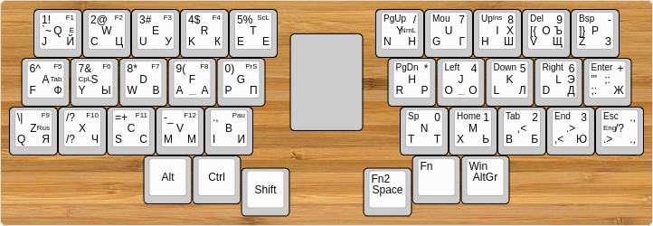
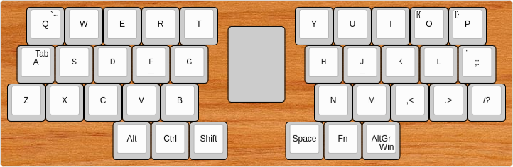

# Аккордовая полисимвольная клавиатура КошкоКлава-А36 (CatBoard-A36)

Дальнейшее развитие клавиатуры [CatBoard-2](http://catboard.klava.org/ru.html) и CatBoard-3 (отличается от предыдущей только корпусом). Количество кнопок уменьшено с 60 до 36, для многих кнопок используются удобные аккорды, чаще всего это две рядом стоящие кнопки, возможен набор нескольких букв одним аккордом, вводимые буквы всегда выстраиваются в определённом порядке вне зависимости от порядка нажимаемых кнопок в аккорде, любые буквы всегда можно завершить вводом пробела этим же аккордом, вместо автоповтора используется умножитель нажатия кнопки, только для слоя навигации, если одновременно нажимаются и цифры.

## Раскладка клавиатуры

В клавиатуре может присутствовать две аппаратные раскладки, при этом при зажатых модификаторах Alt, Ctrl, Win, всегда будет использоваться первая раскладка.

Можно работать как в QWERTY, так и в фонетической JCUKEN раскладке, на компьютере при этом нужно настроить лишь QWERTY раскладку, и ЙЦУКЕН для русского языка.

Клавиатура аккордовая, поэтому последовательность нажатия нескольких кнопок не важна, главное, какое будет сочетание кнопок при отпускании первой. Приоритет имеют кнопки переключения слоёв и двойные соседние кнопки на одном ряду, если у них установлен аккорд, то сработает он, иначе сработает нажатие нескольких кнопок в определённом порядке, не в порядке их нажатия, а по схеме Согласная-Гласная-Пробел, если согласных или гласных несколько, то они идут в порядке слева-направо-сверху-вниз. При нажатии нескольких цифр, они будут напечатаны в порядке возрастания.

Цифры с кнопками навигации и правки работают как умножитель нажатия кнопки, повторяя нажатие этой кнопки выбранное количество раз, цифры умножителя суммируются, ноль равняется десяти.

Сочетания Ctrl+Home/End работают только с умножителем более 1 (умножитель при этом не работает), чтобы предотвратить случайные нажатия.

Раскладка в [Keyboard Layout Editor](http://www.keyboard-layout-editor.com/#/gists/d8e9c413d44c5048d341a1889e236c99)

## Сборка и загрузка прошивки

Собрать проект можно командой:

	$ cd firmware
	$ make

Если проект не собирается, следуйте инструкциям, которые будут выведены в консоль.

Нажимаем кнопку на контроллере, и прошиваем содержимое файла cata36.hex в постоянную память контроллера:

	$ make dfu

Если прошиваемся с этой же клавиатуры, то сначала запускаем нижеследующую команду, и сразу же нажимаем кнопку на контроллере, если не успеваете нажать кнопку, увеличьте количество секунд в команде sleep:

	$ sleep 5; make dfu
